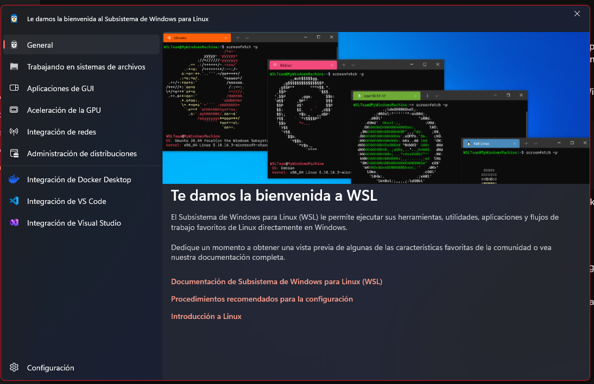
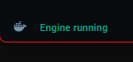
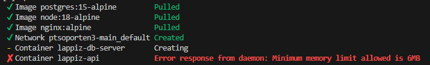
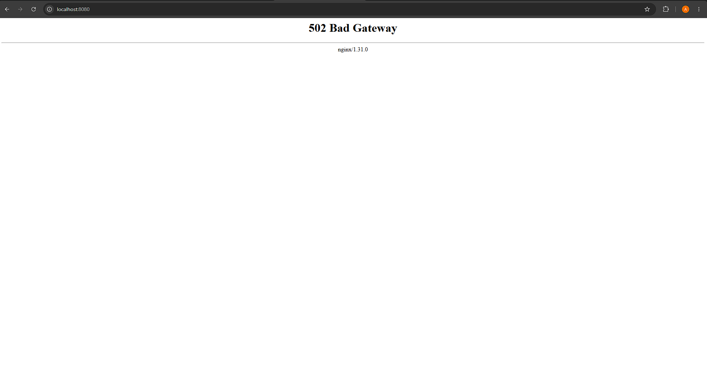
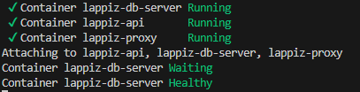
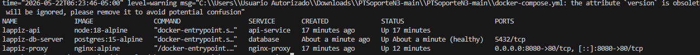
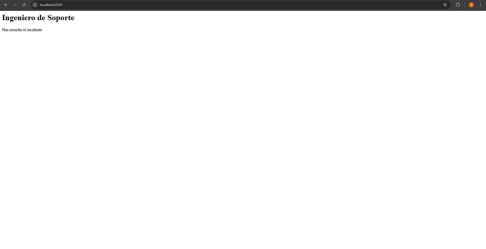

# 🛠️ Reporte Técnico de Soporte N3: Resolución del Incidente

**Especialista a cargo:** Alejandra Cordón  
**Estado final del servicio:** OPERATIVO / SALUDABLE (Healthy)  

---

## 1. Preparación e Instalación del Entorno Base
Para garantizar la compatibilidad y el rendimiento del despliegue en infraestructura local Windows, se configuró:
* **Activación de WSL 2:** Backend nativo de Subsistema de Windows para Linux y plataforma de máquina virtual de alto rendimiento.
* **Docker Desktop:** Integrado correctamente con WSL 2, verificando el estado activo y en ejecución del motor de contenedores.

---

## 2. Diagnóstico y Corrección de Errores (Análisis de Causa Raíz - RCA)

Durante la auditoría del stack de infraestructura como código, se identificaron y mitigaron **cuatro fallos críticos** que impedían la disponibilidad del servicio:

#### **Fallo 1: Aborto del Despliegue por Insuficiencia de Memoria (`lappiz-api`)**
* **Síntoma:** Al ejecutar `docker-compose up -d`, el demonio de Docker arrojó el error: `Error response from daemon: Minimum memory limit allowed is 6MB`.
* **Causa Raíz (RCA):** El archivo original definía un límite de recursos de `memory: 5M` para el microservicio de la API. Docker exige un mínimo estricto de 6MB por contenedor para inicializar procesos aislados en el kernel de Linux.
* **Solución:** Se editó el archivo `docker-compose.yml` elevando la restricción a un umbral operativo estándar de **512M**.

#### **Fallo 2: Error de Bucle Local en la Red (`DB_HOST`)**
* **Síntoma:** La API de Node.js no lograba establecer comunicación con la base de datos relacional.
* **Causa Raíz (RCA):** La variable de entorno `DB_HOST` estaba apuntando a `'localhost'`. En entornos dockerizados, `localhost` resuelve al propio contenedor aislado (loopback) y no a la red compartida del stack.
* **Solución:** Se modificó la variable en el `docker-compose.yml` para apuntar al hostname **`'database'`**, delegando el enrutamiento al DNS interno de la red bridge de Docker Compose.

#### **Fallo 3: Enrutamiento Erróneo del Proxy Inverso (`nginx.conf`)**
* **Síntoma:** El navegador denegaba la conexión o arrojaba errores 502 Bad Gateway al consultar el puerto público.
* **Causa Raíz (RCA):** El bloque `upstream` en el archivo `nginx.conf` enviaba las peticiones al puerto `8080` (`server api-service:8080`), mientras que la API de Node.js estaba configurada mediante `target_output` para escuchar internamente en el puerto **4500**.
* **Solución:** Se corrigió el archivo de configuración de Nginx cambiando el puerto de destino al valor real (**4500**) y se reinició el contenedor del proxy (`docker-compose restart nginx-proxy`).

#### **Fallo 4: Especificación de Versión Obsoleta (`version: '1'`)**
* **Síntoma:** Al levantar el stack, el motor de Docker arrojaba una advertencia indicando que el atributo `version` está obsoleto y será ignorado en futuras entregas.
* **Causa Raíz (RCA):** El archivo original declaraba un estándar heredado antiguo (`version: '1'`). En las especificaciones actuales de Docker, definir la versión en la cabecera es obsoleto debido a que el motor moderno procesa de forma nativa todo el conjunto de herramientas actual de la rama 3.
* **Solución:** Se actualizaron las directivas iniciales del archivo a la especificación estándar moderna **`version: '3.8'`** para estandarizar el manifiesto y limpiar los logs de advertencias innecesarias en la consola de soporte.

---

## 3. Plus Implementado: Orquestación y Healthcheck de Dependencias
Para asegurar la alta disponibilidad y evitar condiciones de carrera (*race conditions*) donde la API intente realizar consultas antes de que el motor de la base de datos haya inicializado sus puertos, se implementó una arquitectura de validación de salud:

* **Healthcheck Nativo en PostgreSQL:** Se integró la herramienta `pg_isready` dentro del servicio de base de datos con un intervalo de escaneo de 5 segundos.
* **Control de Flujo:** Se condicionó el arranque de `api-service` utilizando `depends_on` bajo la directiva **`condition: service_healthy`**.

**Resultado:** El clúster ahora garantiza que la API de Node.js se mantendrá en estado de espera controlado hasta que la base de datos se declare formalmente en estado **Saludable (Healthy)**.

---

## 4. Verificación de Éxito e Inspección Visual
Tras corregir la configuración de la infraestructura, todos los servicios se estabilizaron exitosamente. A través de la consola se constata el correcto despliegue operativo y de salud del stack:

### Verificación del Estado Saludable (Terminal)

Al consultar el puerto público asignado (`http://localhost:8080`), el proxy inverso procesa y sirve correctamente la respuesta de la API, confirmando la resolución definitiva del incidente:

### Pantalla de Éxito Final (Servicio Operativo)

> **Resultado Exitoso:** *Ingeniero de Soporte - Has resuelto el incidente.*